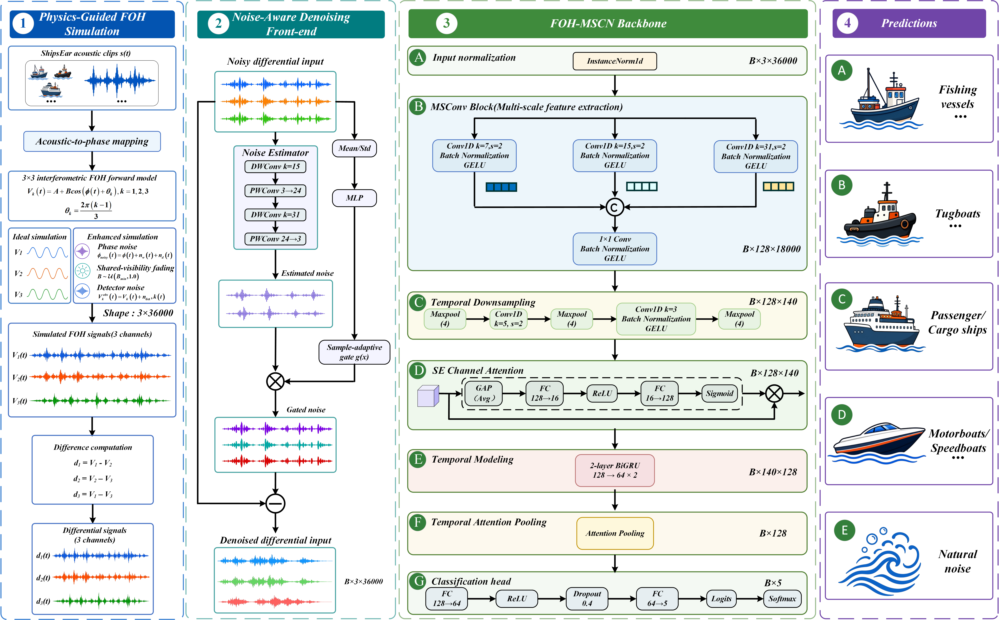

# DN-FOH-MSCN: A physical guidance simulation benchmark and noise-aware classification method for underwater acoustic target recognition using a 3×3 interferometric fiber optic hydrophone


Official implementation of **DN-FOH-MSCN**, a multi-scale channel-aware deep
learning framework for classifying underwater vessels using fiber-optic
hydrophone (FOH) signals. The pipeline converts raw hydroacoustic recordings
(via the ShipsEar dataset) into physics-simulated 3×3 fiber-optic interferometer
outputs, then applies a lightweight residual denoising gate for noise-robust
5-class classification.

## Overview

```
Raw Audio (WAV)
  └── 3×3 FOH Simulation (ideal / degradation-enhanced)
       └── Differential Channels + Phase Demodulation
            └── Gammatone Frequency Spectrum
                 └── MSConv → Channel Attention → BiGRU → Temporal Pooling
                      └── 5-Class Prediction
                           └── Lightweight Residual Denoiser (1,033 params)
```

### What's included

- **Physics simulation**: ideal and degradation-enhanced 3×3 fiber-optic
  interferometer models (phase noise, drift, visibility variation, detector noise)
- **Feature extraction**: differential channels, wrapped-phase demodulation,
  Gammatone filterbank spectrograms (128 channels × 139 frames)
- **Models**:
  - `FOHMSCN` — backbone with multi-scale convolution, channel attention, BiGRU,
    and temporal attention pooling (311,350 parameters)
  - `DenoisedFOHMSCN` — backbone + lightweight residual denoising gate (312,383
    parameters, only 1,033 additional)
- **Pre-trained checkpoints**: six weights (backbone and full model, three
  random seeds each) with SHA256 manifests
- **Evaluation**: SNR-sweep evaluation from clean to 0 dB with deterministic noise
- **Splits**: segment-level (70/10/20) and recording-level (80/20) stratified
  manifests for 16,898 samples across 5 classes

## Installation

```bash
# Create and activate a virtual environment
python -m venv .venv
source .venv/bin/activate   # Linux/macOS
# .venv\Scripts\activate    # Windows

# Install PyTorch (choose the wheel matching your CUDA version)
pip install torch==1.13.1 --index-url https://download.pytorch.org/whl/cpu

# Install remaining dependencies
pip install -r requirements.txt
```

Verify the installation:

```bash
python scripts/smoke_test.py
```

## Data Preparation

1. **Obtain ShipsEar audio** from its official distributor (not included in
   this repository). Comply with the dataset license.

2. **Organize WAV files** as mono, 12 kHz, 3-second segments:

   ```text
   data/shipsear_segments/
     A/  (*.wav, 2,460 files)
     B/  (*.wav, 2,384 files)
     C/  (*.wav, 6,682 files)
     D/  (*.wav, 3,348 files)
     E/  (*.wav, 2,024 files)
   ```

3. **Generate FOH simulation data**:

   ```bash
   python scripts/generate_foh_dataset.py \
     --input-dir data/shipsear_segments \
     --output-dir data/foh_enhanced \
     --condition enhanced --seed 42
   ```

4. **Create split manifests**:

   ```bash
   python scripts/create_split_indices.py \
     --data-dir data/foh_enhanced --output-dir splits \
     --segment-seed 42 --recording-seeds 42 123 456
   ```

## Quick Start: Evaluate a Pre-Trained Checkpoint

```bash
python scripts/evaluate_checkpoint.py \
  --model dn_foh \
  --checkpoint checkpoints/full_seed42.pth \
  --optical-dir data/foh_enhanced \
  --cache-dir cache \
  --split-manifest splits/segment_70_10_20_seed42.csv \
  --snr-levels clean 30 20 10 5 0 \
  --device cuda --batch-size 8 \
  --output results/eval.json
```

## Training

### Backbone (FOHMSCN)

```bash
python optical_classification/train_C_foh_mscn.py \
  --optical-dir data/foh_enhanced \
  --cache-dir cache \
  --output-dir results/backbone_seed42 \
  --split-mode 70-10-20 --seed 42
```

### Noise-Aware Training (DenoisedFOHMSCN)

```bash
# Train backbone
python scripts/noise_paper_experiment.py train \
  --model foh --seed 42 --run-name foh_seed42 \
  --optical-dir data/foh_enhanced --cache-dir cache \
  --results-root results/noise_study \
  --epochs 35 --patience 10 --batch-size 8

# Train denoised variant (auto-loads backbone checkpoint)
python scripts/noise_paper_experiment.py train \
  --model dn_foh --seed 42 --run-name dn_foh_seed42 \
  --optical-dir data/foh_enhanced --cache-dir cache \
  --results-root results/noise_study \
  --epochs 35 --patience 10 --batch-size 8 \
  --init-checkpoint auto

# Aggregate results across seeds
python scripts/noise_paper_experiment.py aggregate \
  --results-root results/noise_study
```

## Repository Structure

```
├── foh_simulation.py              # 3×3 interferometer physics simulation
├── gammatone_features.py          # Gammatone filterbank feature extraction
├── optical_classification/
│   ├── dataset_optical.py         # Data loading, caching, split management
│   ├── train_C_foh_mscn.py        # Backbone model definition + training
│   └── noise_generators.py        # Non-AWGN noise sources (pink, band-limited, etc.)
├── scripts/
│   ├── noise_paper_experiment.py  # Denoised model + noise-aware training pipeline
│   ├── generate_foh_dataset.py    # Batch .mat generation from WAV
│   ├── create_split_indices.py    # Deterministic split manifest generation
│   ├── evaluate_checkpoint.py     # Standalone checkpoint evaluation
│   ├── smoke_test.py              # Installation verification (no data needed)
│   └── verify_anonymity.py        # Pre-release identity leak scanner
├── checkpoints/                   # Pre-trained model weights (6 files)
├── configs/                       # JSON configuration files
├── splits/                        # CSV split manifests (16,898 rows each)
└── results/reference/             # Reference metrics for validation
```

## Model Architecture



## Scientific Invariants

- Differential channels: `d1 = V1-V2`, `d2 = V2-V3`, `d3 = V1-V3`
  with exact identity `d3 = d1 + d2`.
- No per-channel normalization or visual offsets are applied in preprocessing.
- All random seeds are fixed for deterministic reproduction.

## Dependencies

| Package       | Version |
|---------------|---------|
| Python        | ≥ 3.10  |
| PyTorch       | 1.13.1  |
| NumPy         | 1.24.4  |
| SciPy         | 1.15.2  |
| scikit-learn  | 1.6.1   |
| librosa       | 0.11.0  |
| soundfile     | 0.13.1  |

See `requirements.txt` for the full pinned list.

## Citation

If you use this code or the DN-FOH-MSCN model in your research, please cite:

```bibtex
@article{...,
  title     = {DN-FOH-MSCN: ...},
  author    = {...},
  journal   = {...},
  year      = {...},
}
```

## License

This project is licensed under the MIT License. See [LICENSE](LICENSE) for details.

> **Note on ShipsEar data**: ShipsEar audio is not distributed with this
> repository. You must obtain it directly from the dataset owners and comply
> with its license terms. The split manifests contain only relative sample
> identifiers and labels — no audio content.
